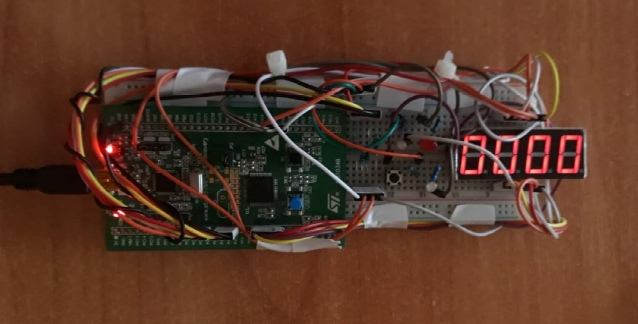

# MC-Donov
Тут мы пишем проект на плате STM32-Discovery под названием "Повтори последовательность"

# Описание проекта
---
В современном мире люди порой испытывают дисгармонию, отсутсвие режима и какого бы то ни было порядка в жизни, потому многие из них начинают обращаться к музыке для восстановления собственного баланса. 
Но вот опять незадача: из-за дисгармонии людям тяжело придерживаться ритму, который очень важен в музыке любого направления. Тут-то им и пригодится наше устройство “rhythm typer” для развития чувства ритма!
С его помощью человек сможет включать случаную последовательность зажиганий лампочки и повторять последовательность зажиганий, нажимая на кнопку и зарабатывя очки при правильном повторении. Так же эта устройство может стать игрой у друзей, которые захотят посоревноваться между собой, кто лучше повторит, или просто подшучивать над еще не знающими об этой поделке.

# Основные особенности оборудования
---
• “Rhythm typer” имеет 3 кнопки: одна для включения, 2я – для запуска самой игры и 3я – для показывания рекордна в этой игре.
• Также устройство оснащено тремя лампочками, одна(красная) из которых свидетельствует о запуске миганий, другая(зеленая) – показывает последовательность миганий и третья(зеленая) – отмечает правильные нажатия кнопки.
• На одной из коротких сторон имеется разьем для питания устройства по mini-USB-b. 
Оборудование стойкое к механическим повреждениям.

# Внешний вид устройства
---

Черная кнопка на плате отвечает за включение устройства;
Черная кнопка на макетной плате – за запуск игры;
При нажатии на синюю кнопку отображается рекорд на этом устройстве с момента его включения;
Рекорд показывается на семисегментнике справа;
Назначение светодиодов описано выше.

# Габариты устройства

18,3 см в длину;
6,8 см в ширину;
2,8 см в высоту;
Масса устройства: 430 грамм
